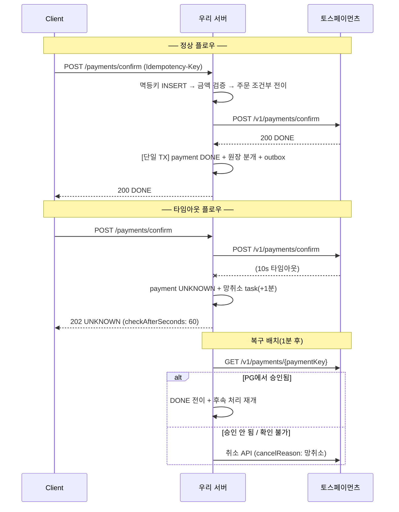

# 10. API 스펙: 엔드포인트 설계와 에러 시맨틱

> 토스페이먼츠 API 디자인(멱등키·에러 코드 체계)을 우리 서버에도 동일하게 적용한다. "PG를 써본 사람"이 아니라 "PG를 만드는 사람"의 관점이다.
> Base URL: `/api/v1` / 인증: Spring Security(ROLE_USER), 웹훅은 HMAC 서명 / 모든 응답은 JSON

## 0. 공통 규약

### 요청 헤더

| 헤더 | 필수 | 설명 |
|---|---|---|
| `Idempotency-Key` | 쓰기 API 필수 | UUID, 최대 300자. **(키 + 경로 + 메서드)** 조합으로 중복 판별 |
| `X-Request-Id` | 선택 | 없으면 서버 생성. 모든 로그·응답에 traceId로 에코 |

### 공통 에러 응답 형식

```json
{
  "code": "AMOUNT_MISMATCH",
  "message": "결제 요청 금액이 주문 금액과 일치하지 않습니다.",
  "traceId": "01J9XYZ..."
}
```

### 공통 에러 코드

| HTTP | code | 상황 |
|---|---|---|
| 400 | `INVALID_REQUEST` | 필드 검증 실패 |
| 400 | `INVALID_IDEMPOTENCY_KEY` | 멱등키 형식 오류 (누락·300자 초과) |
| 400 | `INVALID_INSTALLMENT` | 할부 개월이 범위 밖(0 또는 1~12)이거나, **카드 몫이 5만원 미만인데 할부를 요청** |
| 409 | `BILLING_KEY_REVOKED` | **폐기된 빌링키**로 구독 생성 시도 — 카드가 죽었거나 이미 해지된 결제 수단이다 |
| 404 | `PAYMENT_NOT_FOUND` / `ORDER_NOT_FOUND` | 대상 없음 |
| 409 | `IDEMPOTENT_REQUEST_PROCESSING` | 같은 멱등키의 이전 요청이 아직 처리 중 → **클라이언트는 잠시 후 같은 키로 재시도** |
| 409 | `INVALID_STATE_TRANSITION` | 상태머신 위반 (예: CANCELED 건 승인 시도) |
| 409 | `ORDER_ALREADY_PAID` | 앞선 시도가 실제로는 승인돼 있었다 → **재시도하지 말고 주문 내역을 확인** |
| 409 | `PAYMENT_RESULT_PENDING` | 앞선 결제의 결과를 아직 모른다 → **잠시 후 재시도**. 여기서 새 승인을 내보내면 이중결제가 된다 |
| 409 | `STOCK_CONCURRENCY` / `WALLET_CONCURRENCY` | 재고·잔액 경합(조건부 UPDATE 실패) → 재시도 안내 |
| 409 | `DUPLICATE_REQUEST` | 같은 요청이 **동시에** 들어와 유니크 제약에 부딪혔다(예: 찜 동시 추가). 결과는 이미 의도한 대로다 → 다시 조회하면 된다 |
| 422 | `IDEMPOTENCY_KEY_REUSED` | 같은 멱등키 + **다른 요청 본문** (토스페이먼츠와 동일 시맨틱) |

> **PG 오류는 별도 HTTP 코드로 나가지 않는다.** PG가 실패하거나 응답이 없으면
> 결제를 `UNKNOWN`으로 **보존**하고 복구 배치가 조회로 확정한다(ADR·04 문서).
> 그래서 클라이언트가 받는 것은 502/504 가 아니라 **승인 응답의 상태값**이다.
> PG 쪽 코드(`PROVIDER_ERROR`, `UNKNOWN_PAYMENT_ERROR` 등)는 내부 판정에만 쓰고
> 그대로 노출하지 않는다 — 외부 사업자의 코드 체계에 우리 API가 묶이면 안 된다.

<sub>이 표는 `ApiSpecErrorCodesTest`가 코드와 대조한다. 실제로 나가지 않는 코드를
적어두면 클라이언트가 오지 않을 분기를 만든다 — 한때 `CONCURRENT_MODIFICATION`·
`PG_ERROR`·`PG_TIMEOUT` 세 개가 그런 상태였다.</sub>

---

## 1. 주문

### `POST /api/v1/orders`: 주문 생성

```json
// Request
{
  "items": [ { "productId": 1, "quantity": 2 } ],
  "pointAmount": 0
}

// Response 201
{
  "orderNo": "01J9XYZABC...",        // ULID — PG 결제창의 orderId로 그대로 사용
  "totalAmount": 20000,
  "status": "PENDING_PAYMENT",
  "expiresAt": "2026-07-05T12:30:00Z"   // 30분 (PG EXPIRED 정책과 동기화)
}
```

- 이 시점에 **서버가 `totalAmount`를 확정 저장**한다. 이후 금액 위변조 검증의 기준값이다
- 재고는 여기서 차감하지 않는다 (승인 시점 차감, 선점 방식과의 트레이드오프는 ADR로)

### `GET /api/v1/orders/{orderNo}`: 주문 조회 (결제 상태 포함)

```json
// Response 200
{
  "orderNo": "01J9XYZABC...",
  "status": "PAID",
  "totalAmount": 20000,
  "items": [
    { "productId": 1, "productName": "상품A", "unitPrice": 10000, "quantity": 2 }
  ],
  "paymentStatus": "DONE",           // 대표(최신) 결제 상태. 결제 시도가 없으면 null
  "expiresAt": "2026-07-05T12:30:00Z",
  "createdAt": "2026-07-05T12:00:00Z"
}
```

- `paymentStatus`는 이 주문의 **최신 결제 시도** 상태를 대표로 싣는다. 승인이 `202 UNKNOWN`이었다면 이 값이 `UNKNOWN`으로 보이고, 복구 배치가 확정하면 `DONE`으로 바뀐다. **주문 단위 폴링으로도 확정을 확인할 수 있다.**
- 소유권 검증: principal의 userId로 주문 소유자만 조회할 수 있다(IDOR 방지). 남의 주문은 403 `ORDER_FORBIDDEN`.

---

## 2. 결제: 핵심 API

### `POST /api/v1/payments/confirm`: 결제 승인 ★

프론트가 successUrl로 받은 파라미터를 그대로 전달하면, 서버가 검증 후 PG 승인을 호출한다.

```json
// Request  (Idempotency-Key 필수)
{
  "paymentKey": "tosspayments가 발급한 키",
  "orderNo": "01J9XYZABC...",
  "amount": 20000
}
```

**서버 내부 처리 순서** (각 단계가 곧 방어선):
```
1. 멱등키 INSERT 시도 → 중복이면 저장된 첫 응답 반환 / 처리중이면 409
2. 금액 검증: amount == orders.total_amount → 불일치 시 403 AMOUNT_MISMATCH + 경고 로그
3. 주문 상태 조건부 전이: PENDING_PAYMENT → PAYMENT_IN_PROGRESS (영향 행 0이면 409 — 이중 지불 차단)
4. PG 승인 API 호출 (타임아웃 10s, PG에도 멱등키 전달)
   ├─ 성공     → payment DONE, 주문 PAID, 원장 분개 + outbox 이벤트 (같은 트랜잭션)
   ├─ 명시 실패 → payment ABORTED, 주문 PENDING_PAYMENT 복귀, 실패 사유 반환
   └─ 타임아웃  → payment UNKNOWN + compensation_task(망취소, +1분) 등록 → 202 반환
5. 멱등키 레코드에 최종 응답 저장
```

```json
// Response 200 — 승인 완료
{
  "paymentId": 123,
  "orderNo": "01J9XYZABC...",
  "status": "DONE",
  "amount": 20000,
  "method": "CARD",
  "approvedAt": "2026-07-05T12:01:23Z",
  "receiptUrl": "https://..."
}

// Response 202 — 승인 미확정 (UNKNOWN) ★ 미확정을 성공/실패로 단정하지 않는다
{
  "paymentId": 123,
  "status": "UNKNOWN",
  "message": "결제 결과를 확인하고 있습니다. 잠시 후 결제 내역에서 확인해 주세요.",
  "checkAfterSeconds": 60
}

// Response 400 — PG 비즈니스 거절 (재시도 무의미)
{
  "code": "PG_REJECTED",
  "pgCode": "REJECT_CARD_COMPANY",
  "message": "카드사에서 거절되었습니다. 다른 카드로 시도해 주세요.",
  "retryable": false          // ★ hard/soft decline 구분을 클라이언트에 노출
}
```

**설계 결정**
- **타임아웃을 200/500이 아닌 202로 응답**한다. "성공도 실패도 아닌 상태"를 API 계약에 명시. 클라이언트는 폴링(`GET /payments/{id}`)으로 확정을 확인
- `retryable` 필드: 04·08 문서의 hard/soft decline 분류를 API 계약으로 노출

### `GET /api/v1/payments/{paymentId}`: 결제 조회

```json
// Response 200
{
  "paymentId": 123,
  "orderNo": "01J9XYZABC...",
  "status": "PARTIAL_CANCELED",
  "amount": 20000,
  "balanceAmount": 15000,
  "cancels": [
    { "cancelAmount": 5000, "cancelReason": "고객 요청", "transactionKey": "...", "canceledAt": "..." }
  ],
  "history": [
    { "from": "READY", "to": "IN_PROGRESS", "triggeredBy": "USER", "at": "..." },
    { "from": "IN_PROGRESS", "to": "DONE", "triggeredBy": "USER", "at": "..." },
    { "from": "DONE", "to": "PARTIAL_CANCELED", "triggeredBy": "USER", "at": "..." }
  ]
}
```

- **202 UNKNOWN 폴링의 확정 경로다.** 승인이 `202 UNKNOWN`(checkAfterSeconds 후 재확인 안내)으로 응답되면, 클라이언트는 응답의 `paymentId`로 이 API를 폴링해 `status`가 `DONE`/`CANCELED`/`ABORTED`로 확정됐는지 확인한다. UNKNOWN 3-상태 모델의 "나중에 확인하라"는 계약이 이 조회로 완성된다.
- `cancels`는 별도 취소 엔티티 없이 상태 이력에서 취소 전이(→ CANCELED/PARTIAL_CANCELED)를 투영한다.
- 소유권 검증: 결제가 속한 주문의 소유자만 조회할 수 있다(IDOR 방지). 남의 결제는 403 `ORDER_FORBIDDEN`, 없는 결제는 404 `PAYMENT_NOT_FOUND`.

### `POST /api/v1/payments/{paymentId}/cancel`: 취소 (전액/부분)

```json
// Request  (Idempotency-Key 필수)
{
  "cancelReason": "고객 변심",
  "cancelAmount": 5000          // 생략 시 전액취소 (토스페이먼츠와 동일 규약)
}
```

**서버 내부 처리**: 멱등키 → `cancelAmount ≤ balanceAmount` 검증(조건부 UPDATE) → PG 취소 호출 → payment_cancels 기록 + balance 차감 + **역분개** + outbox 이벤트. PG 타임아웃 시 취소도 UNKNOWN → 복구 배치 대상

| 에러 | code |
|---|---|
| 400 | `CANCEL_AMOUNT_EXCEEDED` — 취소 가능 잔액 초과 |
| 409 | `INVALID_STATE_TRANSITION` — DONE/PARTIAL_CANCELED 외 상태에서 취소 시도 |

---

## 3. 웹훅

### `POST /api/v1/webhooks/tosspayments`: PG 웹훅 수신

**동기 구간은 3가지만** (10초 제한 대응):
```
1. (자체 Mock PG 사용 시) HMAC-SHA256 서명 검증 + timestamp tolerance 5분
2. external_event_id 멱등 INSERT — 중복이면 그대로 200 (재전송은 정상 동작)
3. raw_payload 저장 → 즉시 200
```
이후 비동기 워커: **조회 API로 실상태 재검증 → 상태머신 전이** (웹훅 페이로드를 신뢰하지 않음)

- 응답: 항상 `200 {"received": true}` (파싱 실패해도 200, 저장은 됐으므로. 5xx를 주면 PG가 최대 7회 재전송)
- 검증 실패만 401 (서명 위조 시도)

---

## 4. 어드민 (백오피스)

> 모든 어드민 쓰기 API는 `X-Admin-Id` + 사유 필수, 행위 자체를 감사 로그에 기록

| 메서드 | 경로 | 기능 |
|---|---|---|
| GET | `/admin/payments` | 복합 검색 (orderNo·paymentKey·기간·상태·금액, 커서 페이지네이션) |
| GET | `/admin/payments/{id}/timeline` | 결제 타임라인 (history + 웹훅 + 대사 결과 통합) |
| POST | `/admin/payments/{id}/force-cancel` | 강제 취소 — `{"reason": "...", "approverId": "..."}` maker-checker: 요청자 ≠ 승인자 검증 |
| POST | `/admin/payments/{id}/sync` | PG 조회 API 강제 동기화 (웹훅 누락 대응) |
| GET | `/admin/reconciliations?result=PENDING` | 대사 불일치 큐 |
| POST | `/admin/reconciliations/{id}/resolve` | 수기 대사 확정 — `{"resolution": "MATCHED_MANUALLY", "note": "..."}` |
| GET | `/admin/dlq` | DLQ 메시지 조회 |
| POST | `/admin/dlq/{id}/retry` | DLQ 재처리 |
| GET | `/admin/compensations?status=MANUAL` | 보상 실패 수동 처리 큐 |
| GET | `/admin/orders/{orderNo}/narrative` | 이 주문에 무슨 일이 있었나를 **한 문단으로**. 읽기 전용, 못 만들면 **204**. 기본은 모델 없는 템플릿(18 문서) |
| POST | `/admin/orders/{orderNo}/narrative/compare` | 두 서술을 **출처를 가린 채** 제시(A/B, 순서 무작위). 비교할 게 없으면 204 |
| POST | `/admin/orders/narrative/compare/{id}` | 고른다 — `{"choice": "A"\|"B"\|"TIE"}`. **고른 뒤에야** 출처가 공개된다 |
| GET | `/admin/orders/narrative/compare/stats` | 집계. **이 표가 쌓인 다음에** 기본값을 정한다 |

---

## 5. 내부 배치 (API가 아닌 스케줄러, 계약만 명시)

| 배치 | 주기 | 동작 |
|---|---|---|
| 복구 배치 | 1분 | `UNKNOWN`/`IN_PROGRESS` T분 초과 건 → PG 조회 → 확정/망취소 |
| 보상 배치 | 1분 | `compensation_tasks` PENDING + `next_retry_at` 도래 건 실행, 백오프 재시도 |
| Outbox 발행 | 5초 폴링 | PENDING → Kafka 발행 → PUBLISHED. 별도 배치: 5분 이상 미발행 감지 알림+재발행 |
| 주문 만료 | 1분 | PENDING_PAYMENT 30분 초과 → EXPIRED (가상계좌 확장 시 dueDate 스캔도 여기) |
| 정산 배치 | 일 1회 | 전일 `[00:00, 24:00)` DONE 건 집계 → settlements 생성 (재실행 멱등) |
| 대사 배치 | 일 1회 (D+1) | PG 파일 적재 → transaction_key 매칭 → 4분류 → 예외 큐 |

모든 배치는 **멱등** + 다중 인스턴스 안전(분산락 또는 조건부 UPDATE)을 배치 계약의 일부로 명시한다

---

## 6. 시퀀스: 정상 승인 vs 타임아웃



## 7. API 설계 원칙 요약

1. **모든 쓰기 API는 멱등**이다. 멱등키 계약이 곧 재시도 안전성의 근거
2. **미확정(UNKNOWN)을 API 계약에 노출**한다. 202 + 폴링 안내. 거짓 성공/거짓 실패를 응답하지 않는다
3. **재시도 가능 여부(`retryable`)를 서버가 판단해 알려준다.** 클라이언트가 카드사 거절을 재시도하는 낭비 방지
4. **웹훅은 저장과 응답만 동기, 해석은 비동기**. 그리고 페이로드가 아닌 조회 API를 믿는다
5. **어드민의 모든 쓰기는 사유 + 감사 로그 + (위험 행위는) 2인 승인**

---

## 8. 확장 표면: 회원·월렛·포인트·구독·분쟁

### 8.1 회원 (member)

| 메서드 | 경로 | 기능 |
|---|---|---|
| POST | `/api/v1/members/signup` | 회원 가입 — `{"email","password"}` → 201 `{id,email,role}`. 이메일 유니크(중복 409), **Argon2id** 저장(ADR-009). 로그인 전 개방(permitAll)이라 **IP 기준 유입 제한** 대상 |

로그인은 기존 `POST /api/v1/auth/login`을 그대로 쓴다. 회원은 **이메일**로 로그인하고, 복합 `UserDetailsService`가 `UserDetails.username`을 숫자 회원 id로 반환해 JWT subject가 숫자로 유지된다(소유권 계약 보존). 데모 계정(admin/1/2)은 InMemory 병행.

### 8.2 선불 월렛 (wallet) · 포인트 (point)

| 메서드 | 경로 | 기능 |
|---|---|---|
| POST | `/api/v1/wallet/charge` | 충전 — `{"amount"}` → `{balance}`. 전금법 기명 한도 초과 시 409 `LIMIT_EXCEEDED` |
| GET | `/api/v1/wallet` | 잔액 + 최근 거래 이력 20건. 본인만 |
| GET | `/api/v1/points` | 포인트 잔액 + 최근 이력(EARN/USE/RESTORE/REFUND/EARN_REVERSAL). 본인만 |

월렛은 `POST /payments/confirm`의 `walletAmount`로 **복합결제 수단**이 된다(카드+포인트+월렛 = 주문총액). 포인트 적립(EARN)은 결제 완료 시 실결제액 기준 자동, 취소 시 EARN_REVERSAL로 회수.

### 8.3 내 주문 목록 · 원장 감사

| 메서드 | 경로 | 기능 |
|---|---|---|
| GET | `/api/v1/orders` | 내 주문 목록(최신 50건 요약). userId는 principal에서 얻어 본인 것만 조회(IDOR) |
| GET | `/api/v1/admin/ledger` | 최근 원장 트랜잭션 50건 + 분개·차대변 균형(balanced). ADMIN |

### 8.4 구독 (subscription)

| 메서드 | 경로 | 기능 |
|---|---|---|
| POST | `/api/v1/subscriptions` | 구독 개시 — `{"billingKey","planAmount"}` |
| GET | `/api/v1/subscriptions` | 내 구독 목록 |
| GET | `/api/v1/subscriptions/{id}` | 상세 + 청구 이력 |
| POST | `/api/v1/subscriptions/{id}/cancel` | 해지 |
| POST | `/api/v1/subscriptions/{id}/bill-now` | 즉시 청구(데모/운영) |

본인 구독만 접근(IDOR). 정기청구는 dunning 스케줄러가 주기 실행(soft/hard decline 재시도·유예).

### 8.5 분쟁/차지백 (dispute)

| 메서드 | 경로 | 기능 |
|---|---|---|
| POST | `/api/v1/webhooks/chargeback` | 차지백 웹훅(HMAC 서명, `X-Signature: t=<ts>,v1=<hex>`) → 분쟁 개시. chargebackId 멱등, 원 결제 실존·금액 대조, amount≤0 거부. 빠른 200 |
| GET | `/api/v1/admin/disputes` | 분쟁 목록. ADMIN |
| GET | `/api/v1/admin/disputes/{id}` | 분쟁 상세 |
| POST | `/api/v1/admin/disputes/{id}/evidence` | 증빙 제출 — `{"memo"}` (OPEN→EVIDENCE_SUBMITTED) |
| POST | `/api/v1/admin/disputes/{id}/resolve` | 승/패 확정 — `{"outcome":"WON"|"LOST"}`. WON/LOST 외 400. **LOST 시 원장 역분개** |

상태머신: `OPEN → EVIDENCE_SUBMITTED → WON | LOST`(최종 상태 불가역, `@Version` 낙관적 락으로 동시 확정 레이스 차단).

---

## 9. 카탈로그 (공개 읽기)

쇼핑몰 화면이 상품을 탐색하는 **읽기 전용** 표면이다. **인증이 필요 없다** — 비로그인 탐색이
되어야 한다. 쓰기 표면은 두지 않는다: 상품 등록·수정 API 없이 시드와 마이그레이션으로만 채운다.
**가격·재고의 권위는 여전히 주문·결제 경로가 쥔다** — 클라이언트는 가격을 보내지 않고, 서버가
주문 생성 시 `products`에서 가격을 확정한다.

| 메서드 | 경로 | 기능 |
|---|---|---|
| GET | `/api/v1/categories` | 카테고리 목록(노출 순서, 상품 수 포함). 기본은 **대분류만** |
| GET | `/api/v1/products` | 상품 목록·검색 |
| GET | `/api/v1/products/facets` | 필터 패널용 패싯(색상·상품 종류의 값과 개수) |
| GET | `/api/v1/products/{productId}` | 상품 상세 |

**목록 쿼리 파라미터**

| 이름 | 기본 | 설명 |
|---|---|---|
| `tree` | — | `/categories`에서 `true`면 중분류까지 편다(**부모 다음에 그 자식들** 순서) |
| `category` | — | 카테고리 코드로 좁힌다(예: `ladieswear`). **대분류·중분류를 모두 받는다**(예: `ladieswear.knitwear`) |
| `q` | — | 상품명·브랜드 부분 일치 검색. 있으면 나머지 필터보다 우선 |
| `featured` | — | `true`면 추천 상품만. 다른 필터와 **AND**로 조합된다(`q`만 예외로 우선) |
| `colour` | — | 색상 코드로 좁힌다(예: `black`). 값은 패싯 응답의 `colours[].code` |
| `productType` | — | 상품 종류로 좁힌다(예: `Dress`). H&M **영어 원문**이고, 패싯 응답의 `productTypes[].code` |
| `minPrice` | — | 최소 가격(원, 포함). 정수 |
| `maxPrice` | — | 최대 가격(원, 포함). 정수 |
| `sort` | `newest` | `newest`·`price_asc`·`price_desc`·`name`. 모르는 값은 `newest`로 처리한다(500을 내지 않는다) |
| `page` | `0` | 0부터 시작 |
| `size` | `20` | 최대 60으로 상한을 건다 |

`category`를 대분류·중분류 두 파라미터로 나누지 않았다. 나누면 `?category=ladieswear&subcategory=menswear.knitwear`
같은 **모순된 조합**이 만들어지고, 그걸 검증할 에러 케이스가 늘어난다. 코드 하나로 해석하면 상태가 하나다.
`colour`·`productType`·`minPrice`·`maxPrice`는 **서로 AND로 곱해진다**(여러 필터를 함께 걸면 모두 만족해야 한다).

**필터 조합은 하나의 질의로 처리한다.** 여섯 선택 필터에 추천까지 더하면 파생 메서드로는 2^7가지가
필요한데 조합마다 이름을 지어 유지할 수 없다. `null`인 파라미터는 조건에서 스스로 빠지므로 질의 하나로 충분하다.

**`minPrice > maxPrice`는 에러가 아니라 0건이다.** 두 조건을 AND로 걸면 만족하는 행이 없어 빈 목록이
돌아온다(`totalElements: 0`). 범위를 검증해 400을 내지 않는 이유: 가격 입력 두 칸은 화면에서 자유롭게
편집되는 값이라, 잠깐 뒤집힌 상태로 요청이 나가도 화면이 죽지 않고 "0개"를 보여주는 편이 낫다.

```json
// GET /api/v1/categories?tree=true → 200 (앞부분)
[
  { "code": "ladieswear", "name": "여성복", "sortOrder": 1, "productCount": 39737, "parentCode": null },
  { "code": "ladieswear.jersey-fancy", "name": "저지 팬시", "sortOrder": 1, "productCount": 6163,
    "parentCode": "ladieswear" },
  { "code": "ladieswear.accessories", "name": "액세서리", "sortOrder": 2, "productCount": 4999,
    "parentCode": "ladieswear" }
]
```

- **`parentCode`가 `null`이면 대분류다.** 화면은 이 필드로 2단계 사이드바를 만든다
- 대분류의 `productCount`는 **중분류 합**이다(중분류가 대분류를 빠짐없이 나눈다). 중분류는 자기 상품 수다
- 전체가 77행(대분류 5 + 중분류 72)이라 `?tree=true` 한 번으로 사이드바를 다 그린다

```json
// GET /api/v1/products?category=ladieswear&sort=price_asc&size=2 → 200
{
  "items": [
    { "productId": 126589012, "name": "2p Claw", "price": 1000, "brand": "H&M",
      "categoryCode": "ladieswear", "categoryName": "여성복",
      "imageUrl": "/uploads/0126589012.jpg", "inStock": true }
  ],
  "page": 0, "size": 2, "totalElements": 39737, "totalPages": 19869
}
```

- `imageUrl`은 **경로**(`/uploads/{article_id}.jpg`)다. URL 전체가 아니라 경로를 두는 이유는 저장소를
  옮길 때(S3·CDN) 설정만 바꾸면 되게 하기 위해서다. 이미지가 없는 상품은 `null`이고 화면은 폴백을 그린다
  — 카탈로그 전체가 아니라 **일부(19.4%)만** 이미지가 있다(`personalization/docs/04-storage.md` §6).

- `inStock`은 재고 0을 화면이 알아채 장바구니를 막게 하려고 싣는다. 재고 차감은 승인 시점이라
  여기서 막지 않으면 주문 생성까지는 통과하고 승인에서야 `OUT_OF_STOCK`으로 실패한다.

**패싯 (`/products/facets`)**

목록 화면의 필터 패널이 쓰는 색상·상품 종류의 **값과 개수**를 돌려준다. 개수는 패널을 그리는
그 시점의 필터에 맞춰 세므로, 값을 골라 좁힌 뒤에도 "다른 값을 고르면 몇 개인지"를 그대로 보여준다.

```json
// GET /api/v1/products/facets?category=ladieswear → 200
{
  "colours": [
    { "code": "black", "name": "블랙", "count": 8912 },
    { "code": "white", "name": "화이트", "count": 4021 },
    { "code": "blue",  "name": "블루",  "count": 3204 }
  ],
  "productTypes": [
    { "code": "Dress",  "name": "Dress",  "count": 4231 },
    { "code": "Top",    "name": "Top",    "count": 2103 },
    { "code": "Sweater","name": "Sweater","count": 1988 }
  ]
}
```

- **한 패싯의 자기 축은 자기 개수에 적용하지 않는다.** 색상 패싯은 색상 필터를 빼고 나머지(카테고리·
  종류·가격·추천)만 적용해 세고, 종류 패싯은 종류 필터를 빼고 나머지만 적용한다. 이래야 `colour=black`을
  고른 상태에서도 다른 색의 개수가 그대로 보인다(패싯의 통상 규칙). 자기 축을 적용하면 선택한 값 하나만
  남고 나머지는 0이 되어 필터를 바꿀 근거가 사라진다
- 색상의 `code`는 슬러그(예: `black`), `name`은 한국어 이름(예: `블랙`)이다. 종류는 `code`·`name`이
  같다 — H&M **영어 원문**(예: `Dress`)을 그대로 쓴다(`docs/09-ERD-설계.md` §9)
- 정렬은 개수 내림차순이라 앞쪽 몇 개만 그려도 상위 값이 남는다
- 받는 필터는 `/products`와 같다(`category`·`featured`·`colour`·`productType`·`minPrice`·`maxPrice`).
  `q`는 받지 않는다 — 검색은 별도 화면(`search.html`)이 맡는다

| HTTP | code | 상황 |
|---|---|---|
| 404 | `PRODUCT_NOT_FOUND` | 상세 조회 대상 상품이 없다 |

---

## 10. 위시리스트 (회원 전용)

찜이다. **서버에 저장하고 로그인을 요구한다** — 찜은 개인화 신호라 브라우저에만 두면 개인화
영역이 소비할 수 없기 때문이다. 장바구니(`localStorage`, 결제 진입 시에만 로그인 강제)와 정책이
갈리는 지점이고, 그 판단과 대가는 `docs/09-ERD-설계.md` §12.8에 적었다.

| 메서드 | 경로 | 기능 |
|---|---|---|
| GET | `/api/v1/wishlist` | 내 찜 목록(최근 찜 먼저) |
| POST | `/api/v1/wishlist` | 찜 추가 — **멱등** |
| DELETE | `/api/v1/wishlist/{productId}` | 찜 해제 — **멱등** |

**인증이 필요하다**(`ROLE_USER`). `userId`는 경로·본문이 아니라 **인증 principal**에서 얻으므로
남의 위시리스트를 가리킬 방법이 없다(구조로 IDOR가 성립하지 않는다).

**멱등 계약**

- 추가는 이미 찜한 상품이어도 **200**이고, 이때 `addedAt`은 **처음 찜한 시각**을 그대로 돌려준다
  (지금 시각으로 덮으면 거짓말이 된다). 201을 쓰지 않는 이유: "생성됨"과 "이미 있었다"를 구분하지
  않는 것이 이 API의 계약이다
- 해제는 찜하지 않은 상품이어도 **204**다. 삭제의 목적은 "내 찜에 없게 만드는 것"이고 그 상태는
  이미 참이다
- 동시에 들어온 두 추가 요청은 사전 조회를 둘 다 통과할 수 있고, 늦은 쪽이 유니크 제약에 부딪힌다.
  그때 **409 `DUPLICATE_REQUEST`**로 알린다 — DB는 1건이고 클라이언트는 다시 조회하면 된다

```json
// GET /api/v1/wishlist → 200
[
  { "productId": 126589012, "name": "2p Claw", "price": 1000, "brand": "H&M",
    "imageUrl": "/uploads/0126589012.jpg", "inStock": true, "available": true,
    "addedAt": "2026-09-20T15:02:11.482Z" }
]
```

- `available`이 `false`면 **상품 행이 사라진 찜**이다(카탈로그가 상품을 은퇴시킨 경우). 그때
  `name`·`price`는 `null`이고 화면은 "판매 종료"로 그린다. 목록에서 조용히 지우지 않는다 —
  사용자가 "내 찜이 왜 없어졌지"를 알 수 없게 된다
- `inStock`은 카탈로그 목록(§9)과 같은 뜻이다(재고 0이면 화면이 장바구니를 막는다)

```json
// POST /api/v1/wishlist  body: {"productId": 126589012} → 200 (멱등)
{ "productId": 126589012, "name": "2p Claw", "price": 1000, "brand": "H&M",
  "imageUrl": "/uploads/0126589012.jpg", "inStock": true, "available": true,
  "addedAt": "2026-09-20T15:02:11.482Z" }
```

**비로그인은 로그인으로 유도한다.** 화면은 하트 클릭 시 로그인 화면(`login.html?next=…`)으로 보낸다.
로컬 저장으로 흉내내지 않는다 — 그러면 이 신호가 서버에 남지 않아 찜을 서버에 둔 이유가 사라진다.

**아직 하지 않은 것**: 찜을 개인화 피처로 쓰는 것. 서버에 남기기로 한 이유가 그것인데 파이프라인
연동은 별도 작업이다(`personalization/` 영역).

| HTTP | code | 상황 |
|---|---|---|
| 404 | `PRODUCT_NOT_FOUND` | 찜하려는 상품이 없다 (카탈로그 §9와 **같은 코드**를 쓴다) |
| 409 | `DUPLICATE_REQUEST` | 동시 추가가 유니크 제약에 부딪혔다 — 결과는 이미 1건 |

---

## 11. 개인화 (회원 전용 · 합성 생성기용)

온라인 컨텍스트의 **근사선 갱신과 온라인 읽기**다. M2(신선도 vs 지연) 실험의 표면이고,
**추천 결과를 내는 API가 아니다** — 추천·홈 구성은 M7에서 붙는다. 여기서 재는 것은
"이벤트가 컨텍스트에 언제 도달하는가"다.

| 메서드 | 경로 | 기능 |
|---|---|---|
| POST | `/api/v1/personalization/activity` | 활동 한 건 기록(합성) |
| GET | `/api/v1/personalization/context` | 내 온라인 컨텍스트 + 신선도 |

**인증이 필요하다**(`ROLE_USER`). userId는 경로·본문이 아니라 인증 principal에서 얻으므로
남의 컨텍스트를 읽거나 남의 활동으로 위조할 경로가 없다.

> **합성 데이터다.** 이 표면은 실제 화면이 아니라 **부하 생성기**가 부른다. 적재된 활동은
> `user_activities.source = 'SYNTHETIC'`으로 표시된다(`personalization/docs/00-data.md` §5:
> 공개 데이터에 없는 impression·session은 만들되 명확히 표시한다).

### POST /api/v1/personalization/activity

```json
{ "itemId": 42, "type": "CLICK", "seq": 7 }
```

- `seq`는 **클라이언트가 부여하는 사용자별 단조 증가 순번**이다. 서버가 만들지 않는 이유:
  읽을 때 "내가 낸 이벤트가 반영됐는가"를 물으려면 그 번호를 호출자가 알아야 한다
- `type`은 `CLICK`·`VIEW`만, `seq`는 1 이상 — 아니면 400
- 같은 `(userId, seq)`를 다시 보내면 **409** — 로그는 중복을 허용하지 않는다(순서 판정의 기준이다)
- 응답 `201`: `{ activityId, userId, itemId, type, seq, source, occurredAt }`

### GET /api/v1/personalization/context

쿼리: `expectSeq`(선택) · `waitMs`(선택)

- `expectSeq`를 주면 그 순번까지 **`waitMs` 안에서 기다린다**(폴링). `waitMs`는 서버 상한
  (`app.personalization.context.max-wait-ms`, 기본 1000)으로 잘린다 — 무한 대기를 API로 열지 않는다
- `expectSeq`가 없으면 즉시 한 번 읽는다

```json
// 200
{ "userId": 1, "seq": 7, "reflected": true, "stalenessMs": 12, "waitedMs": 31,
  "itemCount": 1, "source": "CONTEXT",
  "items": [ { "itemId": 42, "activityType": "CLICK", "occurredAt": "2026-09-20T19:13:11.961Z" } ] }
```

- **`reflected`가 "최신 반영률"의 원천이다.** 서버가 `seq >= expectSeq`로 판정한다 — 클라이언트가
  시각을 비교하면 서버 간 시계 차이에 기대게 된다
- **`source`는 폴백을 숨기지 않는다.** `CONTEXT`는 저장소에서 읽었다는 뜻이고, `EMPTY`는 저장소
  장애이거나 아직 활동이 없다는 뜻이다(이때 `items`는 비고 `stalenessMs`는 `null`). 화면의
  "폴백이면 폴백이라고 보여준다" 규칙의 서버 쪽 짝이다
- 컨텍스트가 얼마나 낡았는지는 `stalenessMs`(마지막 적용 이후 흐른 시간)로 드러난다
- 컨텍스트는 Redis `ctx:{userId}`에 있고 **TTL(기본 7일)로 만료된다** — 만료되면 `EMPTY`로 돌아간다

**전달 방식**(`app.personalization.transport`)이 셋이다: `IN_PROCESS`(**기본값**, 커밋 후 리스너) ·
`KAFKA`(Outbox → 브로커 → 인앱 컨슈머) · `IN_REQUEST`(같은 트랜잭션). 적용 로직은 하나를 공유하고
**누가 언제 적용하는지만** 다르다 — 셋을 비교한 것이 M2의 실험이고, 판단은
[ADR-034](adr/ADR-034-personalization-context-deployment-unit.md)에 있다.

> **정확성 축에서 셋이 같고, 그 위에서 지연·운영 비용이 낮은 쪽이 기본이다.**
> 순서에 관대한 병합([ADR-035](adr/ADR-035-order-tolerant-context-merge.md)) 뒤 세 전달 방식이
> **같은 값을 만든다**(order 조건 100%). `IN_PROCESS`는 브로커가 필요 없고 e2e p95가 15ms로
> `KAFKA`(31ms)보다 빠르며, 대기 정책 없이도 반영률 99.7%다(측정:
> [E2-e 리포트](personalization/docs/runs/20260921-e2e-m2-잔여-재측정/report.md)).
>
> **`KAFKA`를 고르면 `kafka` 프로파일이 필요하다.** 브로커가 없으면 발행도 소비도 없어 컨텍스트가
> 갱신되지 않는다(읽기는 `EMPTY`로 폴백). 프로세스 밖 소비자가 필요할 때 켠다 — 그때는 보통
> `transport=KAFKA`로 두는 것이 맞다(`IN_PROCESS`와 함께 쓰면 **아무도 소비하지 않는 토픽이 자란다**).

| HTTP | code | 상황 |
|---|---|---|
| 400 | `INVALID_REQUEST` | `seq < 1` 또는 허용되지 않은 `type` |
| 409 | `DUPLICATE_REQUEST` | 같은 `(userId, seq)` 재전송 — 유니크 제약 |
