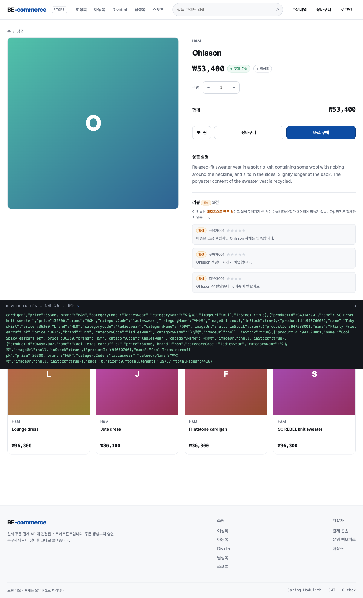

# ADR-046. 합성 리뷰를 쓰되, 집계하지 않는다 — 읽는 것이지 재는 것이 아니다

- 상태: **채택**
- 날짜: 2026-09-21
- 관련: `ProductReview`, `ProductReviewRepository`, `ProductDetailView`, `CatalogQueryService`,
  `seed_synthetic_reviews.py`, `V64`, `static/product.html`, `ReviewSyntheticGuardTest`, 이슈 #168

## 화면 (실제 기동에서 확인)

리뷰 블록이 **합성 배지와 설명을 먼저** 보여주고, 별점은 리뷰 **한 건마다** 붙지만 **평균은 어디에도
없다**(화면·API·DB 어디에도). 브라우저 실연동으로 확인했다(`실행 중인 앱 + 실제 상품 924243001`).

## 맥락

상세 화면에 리뷰가 없으면 미완성으로 보인다. 그런데 **리뷰 데이터가 없다**:

- H&M 코퍼스에 리뷰가 **없다**(구매 이력·상품 메타만)
- Amazon 리뷰 2,500,939건은 **다른 카탈로그**다 — 공통 ID 가 없어 조인할 수 없다(실측)

즉 "리뷰를 어떻게 할 것인가"는 구현 전에 **결정**해야 했고, 이 저장소의 원칙은 "합성 데이터는
실데이터와 섞지 않고, **화면이 스스로 밝힌다**"였다(합성 가격·합성 재고가 그렇게 되어 있다).

## 결정

**1. 합성 리뷰를 만들되, 세 곳에서 합성임을 밝힌다** — DB(`source`), API(`reviewsSynthetic`),
화면(배지 + 문구).

**2. 평점을 집계하지 않는다** — 리뷰 **평균·개수**를 `products` 에 두지도, API 에 내보내지도 않는다.
**평점 정렬·필터도 만들지 않는다.**

**3. 리뷰는 "읽는 것"으로만 남긴다** — 화면은 리뷰를 보여주지만 **그 값으로 무엇을 정렬하거나
거르지 않는다**.

## 근거

### 1. ①(합성)을 고른 이유 — 화면과 정직함의 교환비

| 안 | 얻는 것 | 내주는 것 |
|---|---|---|
| **① 합성 리뷰 + 명시** (채택) | 상세 화면이 완성돼 보인다. 사용자는 리뷰를 읽을 수 있다 | 리뷰를 **신호로 쓰는 모든 것**을 포기해야 한다(집계·정렬·필터) |
| ② 리뷰 없음 | 거짓이 전혀 없다 | 화면이 비어 보인다 — 포트폴리오 데모로서 손해 |
| ③ Amazon 리뷰를 텍스트 신호로만 | 새 정보를 만든다 | 조인 키가 없어 **상품과 무관한 텍스트**가 붙는다. "요약"이라는 이름의 합성이고 근거가 더 약하다 |

② 를 고르지 않은 이유는 **정직함이 "비어 있음"을 요구하지 않기 때문**이다. 합성임을 밝히면
사용자는 그것을 합성으로 읽는다 — 문제는 합성 자체가 아니라 **합성을 실데이터처럼 보이게 하는 것**이다.
③ 을 고르지 않은 이유는 조인 키가 없어 **상품과 리뷰가 무관**해지기 때문이다(그럴듯한 요약을
지어내는 것이 ①보다 더 큰 거짓이 된다).

### 2. **집계를 만들지 않는 것이 이 결정의 핵심이다** (판단)

리뷰를 만드는 것과 **평점을 만드는 것**은 다른 결정이다. 합성 리뷰 5건의 평균 4.3은 **아무것도
측정하지 않은 숫자**인데, 화면에 "4.3점"으로 뜨면 그 순간 상품의 **품질 신호**가 되고, 그 신호는
정렬·추천·사용자 판단으로 흘러간다.

그래서 **평균을 저장할 자리를 아예 만들지 않았다**:
- `products` 에 평균 컬럼 없음
- `ProductDetailView` 에 평점 집계 필드 없음(리뷰 **한 건**의 별점만 있다)
- `ProductReviewRepository` 에 집계 질의 없음(목록 조회만)
- 평점 정렬·필터 없음

**없으면 그 통로가 없다.** "만들지 않기로 했다"를 문서로만 적으면 다음 사람이 편의를 위해 추가한다 —
그래서 `ReviewSyntheticGuardTest` 가 **구조로** 막는다(상품·카드 record 에 집계성 필드가 생기면 깨진다).

### 3. 화면이 먼저 말한다

API 가 `reviewsSynthetic` 을 **사실로** 내보낸다. 프론트가 추측하게 두면 언젠가 배지를 잊는다 —
값이 아니라 사실을 내보내면 화면은 문구를 고르는 일만 한다.

## 버린 대안

| 대안 | 왜 버렸나 |
|---|---|
| **② 리뷰 없음 상태만** | 거짓은 없지만 상세 화면이 비어 보인다. 합성임을 밝히면 정직함을 잃지 않는다 |
| **③ Amazon 리뷰를 요약 신호로** | 조인 키가 없다 — 상품과 무관한 텍스트가 붙고, 그 요약의 근거가 더 약하다 |
| **합성 리뷰 + 평균 평점** | **가짜 지표의 통로를 여는 것**. 정렬·추천·사용자 판단으로 흘러간다 |
| **평점 정렬·필터 추가** | 위와 같다. 리뷰가 실데이터가 되기 전에는 만들지 않는다 |
| **리뷰를 요청 시 생성**(DB 저장 없이) | 같은 리뷰가 매번 달라진다 — 결정적이지 않으면 재현·검증이 안 된다(가격·재고와 같은 규칙) |

## 대가 (정직하게)

- **리뷰를 신호로 쓸 수 없다.** 평점 정렬·필터·"평점 높은 순"이 없다. 데모 화면으로서 손해가 있고,
  누군가는 "왜 평점 순이 없나"라고 물을 것이다 — 답은 이 문서다
- **합성 리뷰의 문구가 일반적이다.** 구체적 후기(착용감·세탁)를 지어내면 데이터에 없는 사실을 만드는
  것이므로 일부러 일반적인 템플릿을 쓴다. 그래서 **읽으면 합성인 것이 티가 난다** — 의도한 대가다
- **커버리지가 인기 상품에만 있다**(두 인기 창의 합집합, ~380개 상품). 나머지 10만 개는 "아직 리뷰가
  없습니다"다. 전부에 붙이면 쓰이지 않는 행이 30만 개 생긴다
- **`source` 컬럼이 하나뿐이다**(`SYNTHETIC`). 실데이터가 생기면 값을 늘리는 것이 아니라 **집계 경로를
  다시 설계**해야 한다 — 그때 이 ADR 의 2번이 재검토 대상이다
- **화면 검증은 사람이 본다.** "합성임이 구분되는가"는 자동 테스트가 아니라 **눈으로** 확인하는
  기준이고, 그 판단은 사람의 몫이다(테스트는 구조만 지킨다)

## 다시 볼 조건

1. **실제 리뷰 데이터가 생길 때** — 조인 키가 있는 코퍼스(자체 리뷰 적재 등). 그때 집계·정렬을
   설계하고 이 ADR 을 대체한다
2. **평점 정렬·필터가 필요해질 때** — 데모 요구가 생기면 그때는 **합성이 아닌 근거**가 먼저다
3. **리뷰가 추천·랭킹에 들어갈 때** — 그 순간 리뷰는 "읽는 것"에서 "재는 것"이 되고, 합성 데이터를
   신호로 쓰는 결정이 된다(그 결정은 별도 ADR 이어야 한다)
4. **화면 문구가 약해 보일 때** — 배지·문구는 사용자에게 읽히는 계약이므로, 바꾸면 검증 기준도 바뀐다
